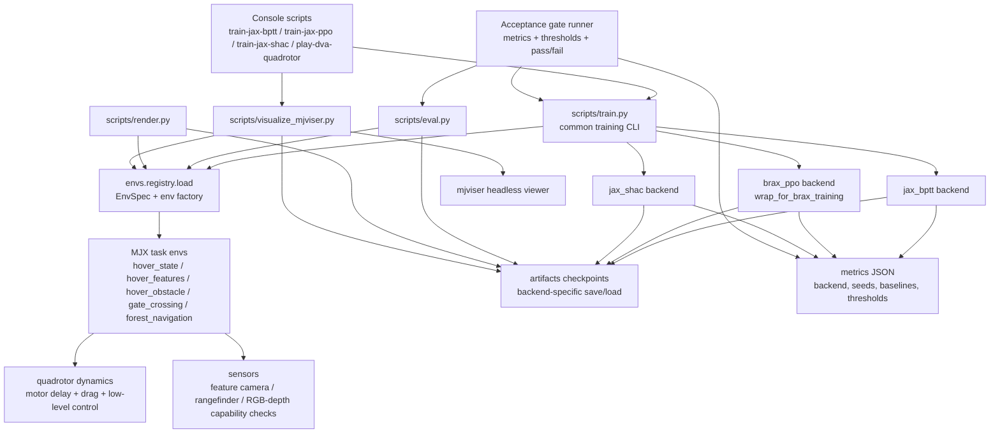

# Design: Complete rpg_flightning On MuJoCo MJX

## Current State

当前仓库已经具备可用但不完整的平台骨架：

- `pyproject.toml` 支持从仓库根目录 editable install，并注册 Playground 风格 console scripts。
- `envs.registry.load` 已注册 `hover_state`、`hover_features`、`hover_obstacle`、`gate_crossing`、`forest_navigation`。
- `scripts/train.py` 已设置 JAX/MuJoCo headless 运行环境，并支持 `bptt`、`ppo`、`shac` 统一入口。
- PPO 已连接 `registry.load`、`wrap_for_brax_training` 和 Brax PPO vectorized trainer。
- `scripts/eval.py`、`scripts/render.py`、`scripts/visualize_mjviser.py` 已存在基础入口。
- `delivery-status-and-grill.md` 记录当前交付状态和防妥协验收共识。

但还不能称为完整 `rpg_flightning` MJX 平台：

- `bptt` 仍需真实 `jax_bptt` backend，不能由 smoke rollout 代替。
- `shac` 仍需真实 `jax_shac` backend，不能由 smoke rollout 代替。
- 三场景的 deterministic reset、success/failure、sensor geometry tests 仍未形成完整验收闭环。
- acceptance runner 仍未实现；reward-improvement gate 还没有机器可执行入口。
- mjviser 三场景命令仍未作为最终验收完成验证。

## Architecture Target

### Package Layout

```text
src/dva_quadrotor_mjx/
  algorithms/
    bptt.py
    ppo.py
    shac.py
  configs/
    tasks/
      hover_state.yaml
      hover_features.yaml
      hover_obstacle.yaml
      gate_crossing.yaml
      forest_navigation.yaml
    algorithms/
      bptt.yaml
      ppo.yaml
      shac.yaml
  controllers/
    motor_model.py
    low_level.py
    rate_controller.py
  dynamics/
    quadrotor.py
    drag.py
  envs/
    base.py
    hover.py
    hover_features.py
    obstacle_avoidance.py
    ring_navigation.py
    forest_navigation.py
    registry.py
    sensors/
      feature_camera.py
      rangefinder.py
      render_camera.py
    xmls/
      quadrotor_base.xml
      hover_state.xml
      hover_obstacle.xml
      gate_crossing.xml
      forest_navigation.xml
  wrappers/
    normalize.py
    logging.py
    vectorization.py
scripts/
  train.py
  eval.py
  render.py
  visualize_mjviser.py
```

### System Architecture



### Non-Functional Requirements

- Reproducibility: acceptance runs must record training seeds, evaluation seeds,
  backend name, config path, thresholds, checkpoint path, and pass/fail result.
- Headless operation: all train/eval/render/play commands must work on the
  remote server with `MUJOCO_GL=egl` or fail with a documented capability error.
- Import hygiene: commands must run from the repository root after editable
  install without manual `PYTHONPATH`.
- Differentiability honesty: state and feature observations can participate in
  differentiable training; rangefinder/RGB/depth boundaries must be explicit
  stop-gradient or non-differentiable observation paths.
- Artifact isolation: generated checkpoints, metrics, and MP4 videos must live
  under `artifacts/` or a configured output directory, never under
  `third_party/`.
- Operational debuggability: every user-facing train command must have matching
  eval, render, and mjviser play paths for the produced checkpoint.

### Component Boundaries

- `envs/` owns task semantics, MJCF selection, reset determinism, observations,
  rewards, done flags, and scene metrics.
- `dynamics/` and `controllers/` own physical stepping, motor delay, drag, and
  low-level control. Task envs should not duplicate these mechanics.
- `sensors/` owns feature projection, rangefinder geometry validation, and
  rendering capability checks. It must not silently synthesize fake RGB/depth
  success.
- `wrappers/` owns action normalization, logging, vectorization, and Brax
  training compatibility.
- `algorithms/` owns backend-specific training loops and checkpoint formats.
  Smoke rollout belongs to diagnostics and must not be exposed as a backend.
- `scripts/` owns CLI translation, config loading, output directories, and
  user-facing commands. It must not contain algorithm logic beyond dispatch.
- `acceptance` runner owns the reward-improvement matrix and produces the final
  delivery evidence.

## Architecture Decision Records

### ADR-001: Independent Package With Playground-Style Interfaces

Status: Accepted

Context:

The project must migrate `rpg_flightning` semantics while remaining usable with
MuJoCo MJX, Brax PPO, jax_shac, and mjviser. Directly embedding inside
`third_party/mujoco_playground` would make local research changes hard to review
and would mix upstream code with experiment-specific algorithms.

Decision:

Keep `dva_quadrotor_mjx` as an independent package, but mirror Playground
interfaces where they are operationally useful: console scripts, environment
registry, `wrap_for_brax_training`, artifact layout, and headless runtime
environment setup.

Consequences:

- Positive: local algorithm and DVA work can evolve without forking Playground.
- Positive: users get familiar Playground-style train/play commands.
- Negative: adapters must be maintained when Brax/Playground APIs change.
- Neutral: compatibility is defined by tests and OpenSpec, not by package
  location.

Alternatives considered:

- Put the project directly inside `third_party/mujoco_playground`: rejected
  because it couples research code to vendored upstream layout.
- Directly port `rpg_flightning` package structure: rejected because MuJoCo MJX
  and Brax trainers need different runtime boundaries.

### ADR-002: Backend Plugin Contract Instead Of One Generic Trainer

Status: Accepted

Context:

`bptt`, `ppo`, and `shac` have different training semantics. PPO is naturally
served by Brax PPO and `wrap_for_brax_training`. BPTT needs differentiable
rollouts and Optax updates. SHAC needs a project-owned adapted backend derived
from `jax_shac`. A single
lowest-common-denominator trainer caused earlier smoke rollout behavior to look
like algorithm completion.

Decision:

Expose one CLI and one result schema, but implement each algorithm as a concrete
backend plugin with backend-identifying metrics:

- `bptt` -> `jax_bptt`
- `ppo` -> `brax_ppo`
- `shac` -> `jax_shac`

The common layer may dispatch, load config, write artifacts, and normalize
result fields. It must not hide smoke rollout behind an algorithm name.

Consequences:

- Positive: backend-specific correctness can be tested directly.
- Positive: metrics reveal what actually ran.
- Negative: checkpoint loaders need backend-specific branches.
- Negative: acceptance matrix is larger because every backend must prove itself.

Alternatives considered:

- Continue using one smoke/baseline rollout path for all algorithms: rejected
  because it cannot prove learning backend parity.
- Copy all third-party trainers into one local trainer: rejected because it
  increases maintenance and obscures reference behavior.

### ADR-003: Acceptance Gate As A First-Class Architecture Component

Status: Accepted

Context:

The project has two kinds of success that must not be confused: command wiring
and learning behavior. Smoke commands validate wiring. Delivery requires
reward improvement, scene-specific non-random behavior, reloadable checkpoints,
and visualization/evaluation usability.

Decision:

Implement an acceptance runner as a first-class component. It evaluates initial
policy and random-policy baselines, runs non-smoke training for the configured
budget, reloads the checkpoint, evaluates with fixed seeds, checks reward and
scene thresholds, and writes pass/fail evidence.

Consequences:

- Positive: delivery claims become auditable.
- Positive: agents cannot lower standards by citing a successful smoke run.
- Negative: acceptance runs are slower than smoke tests.
- Negative: thresholds must be calibrated and versioned with configs.

Alternatives considered:

- Manual inspection of metrics: rejected because it is not reproducible.
- One global mean-reward threshold: rejected because scene metrics differ.

### ADR-004: Semantic JAX Collisions For Scene Rewards

Status: Accepted

Context:

MJX scene XML collision support can reject some collision combinations or make
physics contact behavior hard to differentiate from task semantics. The project
already uses scene geometry primarily for visualization and range queries, while
task rewards need deterministic, JAX-checkable collision/clearance semantics.

Decision:

Use MJCF geometry for visualization and supported sensor/raycast interactions.
Use explicit JAX semantic collision and clearance checks inside env logic for
task reward, termination, and acceptance tests.

Consequences:

- Positive: task semantics are deterministic and testable under JAX.
- Positive: XML collision limitations do not block scene development.
- Negative: physics contacts and semantic collision logic can drift if tests are
  weak.
- Neutral: acceptance must include controlled collision/clearance tests for each
  scene.

Alternatives considered:

- Use MuJoCo physical contacts for all task semantics: rejected for current MJX
  compatibility and controllability risks.
- Disable collision semantics entirely: rejected because scene tasks would not
  prove obstacle navigation behavior.

References:

- `third_party/rpg_flightning/flightning/envs/hovering_state_env.py:183-236`
  computes reward and termination from JAX state and `WorldBox.contains`, not
  from simulator contact buffers.
- `third_party/rpg_flightning/flightning/objects/world_box_obj.py:21-25`
  defines collision as a JAX boolean geometry predicate.
- `third_party/mujoco/doc/mjx.rst:128-130` says MJX contact storage differs
  between JAX and Warp and recommends reading contacts through contact sensors.
- `third_party/mujoco/doc/mjx.rst:466-525` documents MJX geom/contact feature
  gaps, including unsupported collision combinations.
- `third_party/mujoco/doc/mjx.rst:561-587` recommends explicit contact-pair and
  contact-buffer tuning for MJX-JAX performance.
- `third_party/mujoco_playground/mujoco_playground/_src/dm_control_suite/xmls/README.md:1-46`
  documents Playground XML changes for XPU performance, including disabled
  contacts and tuned `max_contact_points` / `max_geom_pairs`.

### Alignment Contract

When this project says "aligned with rpg_flightning", it means:

- Preserve task semantics: reset distribution, observation schema, action
  schema, delay/action history, reward terms, termination semantics, rollout
  shape, and policy save/load behavior.
- Preserve feature-vision semantics: `hover_features` uses projected landmarks
  from the double-sphere camera model, not RGB pixels.
- Preserve differentiability intent: BPTT uses differentiable JAX rollout for
  state/feature observations and documents stop-gradient boundaries for sensors
  that are not differentiable.
- Preserve verification style: fixed-seed numeric/semantic parity tests compare
  shared quantities with documented tolerances.

When this project says "aligned with mujoco_playground", it means:

- Preserve operational shape: package entry points, headless runtime defaults,
  registry-based env construction, config-driven CLI, `artifacts/` outputs, and
  reproducible training/eval/render/play commands.
- Preserve training integration style: PPO uses
  `registry.load -> wrap_for_brax_training -> Brax PPO trainer`; other
  algorithms expose the same user-facing CLI shape while using their own real
  backends.
- Preserve env API style: reset/step return a JAX-compatible `State` with
  pipeline data, observations, reward, done, metrics, and info.
- Preserve visualization/debug path: mjviser and offline render commands inspect
  the same MJCF scene assets used by training.

Alignment does not mean:

- Copying `rpg_flightning` source structure verbatim.
- Putting local code inside `third_party/mujoco_playground`.
- Treating smoke rollout as algorithm parity.
- Treating MJCF physical contacts as the sole source of scene reward or
  termination unless a specific task explicitly chooses that and supplies tests.
- Treating RGB/depth rendering as differentiable unless a documented renderer
  backend proves that property.

### Environment Semantics

#### Base Env

Reference:

- `third_party/rpg_flightning/flightning/envs/env_base.py`
- `third_party/rpg_flightning/flightning/envs/wrappers.py`
- `third_party/jax_shac/envs/mjx_envs.py`

Required work:

- Define a single `State` type with `pipeline_state`, `obs`, `reward`, `done`, `metrics`, `info`.
- Add deterministic `reset`, `step`, `rollout`, `auto_reset`, `vmap` support.
- Remove algorithm-specific monkey patches from environment code.
- Add wrappers equivalent to `LogWrapper`, `VecEnv`, `MinMaxObservationWrapper`.

Acceptance:

- `pytest tests/test_env_base.py -q` passes.
- `jax.jit(env.reset)` and `jax.jit(env.step)` pass for every registered env.
- `jax.vmap(env.reset)` and `jax.vmap(env.step)` pass for every registered env.

#### Hover State

Reference:

- `third_party/rpg_flightning/flightning/envs/hovering_state_env.py`
- `third_party/rpg_flightning/flightning/objects/quadrotor_obj.py`

Required work:

- Lock observation semantics: position, attitude, velocity, angular rate or action history exactly documented.
- Lock action semantics: total thrust + angular-rate command, or expose a compatibility mode matching `rpg_flightning`.
- Match delay, low-level controller, drag, reward, termination, episode length.

Acceptance:

- Numeric parity tests compare reset/step/reward against `rpg_flightning` reference for fixed seeds and fixed actions.
- Error tolerances are explicit:
  - state observation max absolute error <= `1e-4` for shared quantities.
  - reward max absolute error <= `1e-3` for shared reward terms.
  - termination behavior exactly matches for tested boundary cases.

#### Hover Features

Reference:

- `third_party/rpg_flightning/flightning/envs/hovering_features_env.py`
- `third_party/rpg_flightning/flightning/sensors/double_sphere_camera.py`

Required work:

- Recreate `rpg_flightning` feature vision as projected 2D landmarks, not RGB.
- Keep it separate from real RGB/depth perception.
- Implement camera model, feature points, clipping/out-of-view semantics, action history concatenation.

Acceptance:

- `tests/test_hover_features_env.py` verifies landmark projection against `rpg_flightning` for fixed states.
- `scripts/train.py --env hover_features --algo bptt --smoke` runs without error.
- Feature observation shape and action history shape are fixed in spec.

### Three Scene Tasks

#### 1. hover_obstacle

Reference:

- `third_party/rpg_flightning/flightning/objects/world_box_obj.py`
- `third_party/mujoco/doc/overview.rst`
- `third_party/mujoco/python/mujoco/specs_test.py` rangefinder examples

Required work:

- Static obstacle assets in MJCF.
- Goal hover point.
- Collision or clearance reward.
- Optional rangefinder observation.

Acceptance:

- `scripts/train.py --env hover_obstacle --algo bptt --smoke` no error.
- `scripts/train.py --env hover_obstacle --algo ppo --smoke` no error.
- `scripts/train.py --env hover_obstacle --algo shac --smoke` no error.
- `scripts/render.py --env hover_obstacle --random-policy --steps 200 --output artifacts/hover_obstacle.mp4` produces a non-empty MP4 video.

#### 2. gate_crossing

Reference:

- `rpg_flightning` env/reward patterns from `hovering_state_env.py`.
- MuJoCo XML assets and procedural body placement from Playground-style envs.

Required work:

- Gate geometry in MJCF or procedural scene builder.
- Ordered waypoints.
- Success when passing gate plane within opening.
- Failure on collision or timeout.

Acceptance:

- `scripts/train.py --env gate_crossing --algo bptt --smoke` no error.
- `scripts/train.py --env gate_crossing --algo ppo --smoke` no error.
- `scripts/train.py --env gate_crossing --algo shac --smoke` no error.
- `tests/test_gate_crossing.py` verifies waypoint advancement, gate miss, gate hit, collision, timeout.

#### 3. forest_navigation

Reference:

- `DiffPhysDrone` obstacle field ideas:
  - `third_party/DiffPhysDrone/env_cuda.py`
  - `third_party/DiffPhysDrone/main_cuda.py`
- MuJoCo rangefinder docs:
  - `third_party/mujoco/doc/overview.rst`
  - `third_party/mujoco/python/mujoco/specs_test.py`

Required work:

- Deterministic procedural forest generator keyed by PRNG seed.
- Cylinder/tree obstacles.
- Start/goal sampling.
- Rangefinder and optional RGB/depth observation.

Acceptance:

- `scripts/train.py --env forest_navigation --algo bptt --smoke` no error.
- `scripts/train.py --env forest_navigation --algo ppo --smoke` no error.
- `scripts/train.py --env forest_navigation --algo shac --smoke` no error.
- `tests/test_forest_navigation.py` verifies seed-stable obstacle layout, collision, goal success, rangefinder hit distances.

### Three Algorithms

Backend completion has one shared contract for all algorithms. A backend is not
complete because its CLI starts or because smoke rollout writes metrics. It is
complete when non-smoke training writes backend-identifying metrics,
produces a reloadable checkpoint, works through eval/render/mjviser play, and
passes the configured reward-improvement gate. This prevents "pending real
trainer" from being treated as Playground parity.

The reward-improvement gate is implemented by an acceptance runner:

- Evaluate the untrained initial policy and random-policy baseline on fixed
  evaluation seeds.
- Run non-smoke training for the configured acceptance budget.
- Reload the final checkpoint and evaluate it with `scripts/eval.py` on the same
  evaluation seeds.
- Pass the algorithm-env pair when reward delta and the scene primary metric
  meet the configured thresholds.
- Record backend name, seeds, thresholds, baseline metrics, final metrics,
  checkpoint path, and pass/fail result in the metrics artifact.

All public algorithms must pass this gate for `hover_state`, `hover_obstacle`,
`gate_crossing`, and `forest_navigation`. Scene behavior is judged against a
random-policy baseline on env-specific metrics: target distance plus
collision/clearance for `hover_obstacle`, waypoint/gate progress plus collision
for `gate_crossing`, and goal progress plus tree-collision/rangefinder-clearance
for `forest_navigation`.

#### BPTT

Reference:

- `third_party/rpg_flightning/flightning/algos/bptt.py`
- `third_party/rpg_flightning/examples/train_bptt_state.ipynb`
- `third_party/rpg_flightning/examples/train_bptt_vision.ipynb`

Required work:

- Implement a real `jax_bptt` backend, not a smoke rollout adapter.
- Use `jax.vmap` over `num_envs` and `jax.lax.scan` over `unroll_length` / episode chunks.
- Backpropagate through MJX state rollout for state and feature observations where differentiability is available.
- Use `jax.value_and_grad` and Optax to update the deterministic policy.
- Save checkpoints in a format accepted by `scripts/eval.py`, `scripts/render.py`, and `play-dva-quadrotor`.
- Report metrics with `backend="jax_bptt"`, loss, reward, SPS, compile time, and train time.
- Document and enforce stop-gradient boundaries for rangefinder/RGB/depth observations.
- Support state hover and feature hover.

Acceptance:

- `scripts/train.py --algo bptt --env hover_state --smoke` no error.
- `scripts/train.py --algo bptt --env hover_features --smoke` no error.
- `scripts/train.py --algo bptt --env hover_obstacle --smoke` no error.
- `scripts/train.py --algo bptt --env gate_crossing --smoke` no error.
- `scripts/train.py --algo bptt --env forest_navigation --smoke` no error.
- Full run improves evaluation reward by a configured minimum over initial policy for two fixed seeds.
- Metrics artifact includes `backend="jax_bptt"` and does not use smoke-only rollout metrics as a substitute for training.

#### PPO

Reference:

- `third_party/rpg_flightning/flightning/algos/ppo.py`
- `third_party/rpg_flightning/examples/train_ppo_state.ipynb`
- MuJoCo Playground `learning/train_jax_ppo.py`

Required work:

- Clean PPO implementation or clean adapter to Brax PPO.
- No notebook-only path.
- Configurable env/algo YAML.
- Checkpoint save/load.
- Use the MuJoCo Playground training shape: registry-loaded env, `wrap_for_brax_training`, Brax PPO vectorized trainer, and Brax/Orbax checkpoint directories.

Implementation note:

- Earlier CLI work aligned naming and smoke wiring; that is not an accepted training backend.
- PPO parity requires Brax PPO plus the vectorized training wrapper chain.
- BPTT and SHAC parity require their own real backends and backend-identifying metrics; smoke-only rollout artifacts are allowed only as failing diagnostics before implementation is complete.

Acceptance:

- `scripts/train.py --algo ppo --env hover_state --smoke` no error.
- `scripts/train.py --algo ppo --env hover_obstacle --smoke` no error.
- `scripts/train.py --algo ppo --env gate_crossing --smoke` no error.
- `scripts/train.py --algo ppo --env forest_navigation --smoke` no error.
- `scripts/eval.py --checkpoint <ppo_ckpt> --episodes 4` no error.

#### SHAC

Reference:

- `third_party/jax_shac/shac/train.py`
- `third_party/jax_shac/envs/mjx_envs.py`
- `third_party/jax_shac/envs/register_framed_hopper.py`

Required work:

- Implement a real `jax_shac`-semantics backend in
  `src/dva_quadrotor_mjx/algorithms/shac.py`, not a smoke rollout adapter.
- Move current SHAC integration out of `scripts/train.py` monkey patch path.
- Copy/adapt the required `third_party/jax_shac` algorithm pieces into the local
  backend boundary, with comments or README references for substantial derived
  sections.
- Map CLI/YAML config to explicit actor/value update settings.
- Provide stable checkpoint path outside `third_party`.
- Save checkpoints in a format accepted by `scripts/eval.py`, `scripts/render.py`, and `play-dva-quadrotor`.
- Report metrics with `backend="jax_shac"`, actor loss, value loss, reward, SPS, compile time, and train time.
- Add smoke mode and acceptance-budget training mode.

Acceptance:

- `scripts/train.py --algo shac --env hover_state --smoke` no error without manual `PYTHONPATH=src:third_party`.
- `scripts/train.py --algo shac --env hover_obstacle --smoke` no error.
- `scripts/train.py --algo shac --env gate_crossing --smoke` no error.
- `scripts/train.py --algo shac --env forest_navigation --smoke` no error.
- `scripts/eval.py --checkpoint <shac_ckpt> --episodes 4` no error.
- Metrics artifact includes `backend="jax_shac"` and does not use smoke-only rollout metrics as a substitute for training.

### Visualization And Inspection

Reference:

- `third_party/mjviser/README.md`
- `third_party/mjviser/examples/passive_viewer.py`
- `third_party/mjviser/examples/active_viewer_with_controller.py`

Required work:

- Add `scripts/visualize_mjviser.py`.
- Support static scene load:
  - `--env hover_obstacle`
  - `--env gate_crossing`
  - `--env forest_navigation`
- Support rollout replay from checkpoint or recorded trajectory.
- Support random policy/manual hover controller for debugging.

Acceptance:

- `scripts/visualize_mjviser.py --env hover_obstacle --mode scene --port 8080` launches viewer.
- `scripts/visualize_mjviser.py --env gate_crossing --mode random --steps 500 --port 8081` launches viewer and advances simulation.
- `scripts/visualize_mjviser.py --env forest_navigation --checkpoint <ckpt> --steps 500 --port 8082` launches viewer and replays policy.

## Known Risks

- Documentation scan for compromise designs:
  - BPTT/SHAC smoke rollout adapters exist as diagnostics and SHALL NOT count as training backend completion.
  - DVA/APG placeholders belong to `openspec/changes/dva-quadrotor-mjx` and SHALL NOT be promoted as implemented algorithms in this change.
  - RGB/depth rendering availability remains an explicit capability check; tests SHALL skip or fail loudly rather than substituting fake zero images.
  - Scene XML physical collision disablement is accepted when matching JAX semantic collision tests exist.
- MJX/MJWarp rendering is not a dependable differentiable renderer. Use it as observation generation unless a separate differentiable renderer branch is created.
- SHAC currently depends on ad hoc monkey patches. This must be fixed before claiming production-quality training.
- `rpg_flightning` feature vision is landmark projection, not RGB/LiDAR. It should be implemented as compatibility mode, not confused with final perception tasks.
- Exact numeric parity with `rpg_flightning` may be limited by RK integration vs MJX/MuJoCo solver differences. Tests must separate semantic parity from bitwise parity.
